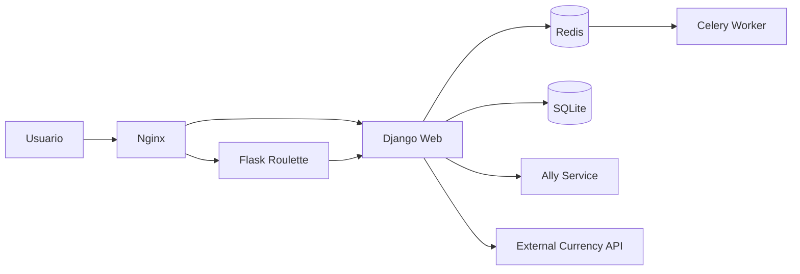

# dangoCasino

> **Desarrollado por:**
> Alejandro Rendon Correa, 
> Erick Santiago Ochoa Barrueto

DangoCasino es una plataforma web de casino académica construida con Django, Flask, Nginx, Docker Compose, Redis y Celery. El sistema conserva la interfaz en Django, mueve la ruleta principal a Flask usando Strangler Pattern y mantiene fallbacks seguros para que la demo no se rompa durante la sustentación.

## Resumen de arquitectura



Componentes principales:

- Django: UI, endpoints JSON, fallback local y orquestación.
- Flask: servicio de ruleta en `POST /api/v2/roulette/play`.
- Nginx: puerta de entrada pública y balanceo por rutas.
- Redis: broker de Celery.
- Celery: auditoría asíncrona de jugadas.
- SQLite: base de datos estable para la entrega final.

## Decisión de base de datos

Para esta entrega se mantiene SQLite. La decisión es intencional: reduce riesgo operativo, evita una migración tardía y conserva la demo estable. PostgreSQL quedó documentado como mejora futura, no como bloqueante de la entrega.

Si luego se quiere migrar, el paso natural sería incorporar `psycopg2-binary` o `dj-database-url`, agregar el servicio de Postgres en `docker-compose.yml` y ejecutar migraciones controladas. Para sustentación académica, esa mejora no era necesaria para demostrar la arquitectura pedida.

## Flujo funcional

1. El usuario entra por Nginx.
2. Django renderiza la UI y recibe la jugada.
3. Django intenta llamar a Flask para resolver la ruleta.
4. Si Flask falla, Django usa fallback local.
5. Django persiste la jugada.
6. Celery recibe la auditoría de forma asíncrona.
7. Ally service y el adaptador de moneda responden con modo mock o fallback si el servicio real no está disponible.

## Rutas principales

- `/` Home.
- `/games/` Lista de juegos.
- `/games/register/` Registro.
- `/games/roulette/` Ruleta.
- `/games/system-status/` Página de sustentación.
- `/health/django/` Health de Django.
- `/health/flask/` Health de Flask.
- `/api/v1/player-summary/<player_id>/` Resumen del jugador.
- `/api/v1/ally-status/` Estado del aliado.
- `/api/v1/currency-rate/` Tasa COP/USD.
- `/api/v2/roulette/play` Ruleta en Flask.

## Internacionalización

La aplicación ya tiene i18n activa con `LocaleMiddleware`, `set_language`, plantillas traducibles y catálogos compilados.

Generación de catálogos:

```bash
python manage.py makemessages -l es
python manage.py makemessages -l en
python manage.py compilemessages
```

Los archivos generados viven en `locale/es/LC_MESSAGES/` y `locale/en/LC_MESSAGES/`.

## Ejecución local con Docker

```bash
docker compose up --build -d
docker compose ps
```

Servicios esperados:

- `nginx`
- `django_web`
- `flask_roulette`
- `redis`
- `celery_worker`

## Verificación rápida

```bash
curl http://localhost/health/django/
curl http://localhost/health/flask/
curl http://localhost/api/v1/player-summary/1/
curl http://localhost/api/v1/ally-status/
curl http://localhost/api/v1/currency-rate/
```

Prueba de ruleta:

```bash
curl -X POST http://localhost/api/v2/roulette/play \
	-H "Content-Type: application/json" \
	-d '{"player_id":1,"bet_type":"number","bet_value":"17","amount":100}'
```

## Sustentación

Antes de presentar, revisa estos archivos:

- [Checklist de sustentación](docs/SUSTENTACION_CHECKLIST.md)
- [Runbook AWS EC2](docs/AWS_EC2_RUNBOOK.md)
- [Diagrama de contenedores](docs/architecture/container-diagram.md)
- [Secuencia Strangler](docs/architecture/strangler-sequence.md)
- [Flujo de resiliencia](docs/architecture/resilience-flow.md)
- [Adapter + DIP](docs/architecture/adapter-dip.md)

Guion recomendado de demo:

1. Abrir Home y explicar la arquitectura híbrida.
2. Abrir System Status.
3. Mostrar health de Django y Flask.
4. Jugar una ruleta y mostrar `source=flask-roulette`.
5. Detener Flask y repetir para mostrar el fallback local.
6. Mostrar Redis y Celery en logs.
7. Cambiar idioma entre español e inglés.

## AWS Academy EC2

El despliegue esperado es simple:

```bash
git clone <REPO_URL>
cd <PROJECT_FOLDER>
docker compose up --build -d
```

El detalle operativo está en [docs/AWS_EC2_RUNBOOK.md](docs/AWS_EC2_RUNBOOK.md).

## Riesgos y pendientes

- PostgreSQL no se activó en esta entrega para evitar riesgo innecesario.
- Si cambian los textos, vuelve a ejecutar `makemessages` y `compilemessages`.
- La validación fuerte sigue siendo Docker Compose + endpoints de health + demo de fallback.

## Estado de entrega

La base está lista para sustentación académica: gateway, microservicio, fallback, adaptador, Celery, i18n, UX y documentación final están preparados.
