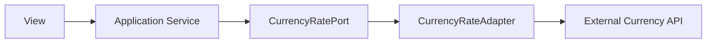

# Adapter + DIP

## Notes
- The view depends on the application service.
- The application service depends on the port abstraction.
- The adapter is the only layer that may use requests.
- This keeps the business logic independent from the HTTP client.
