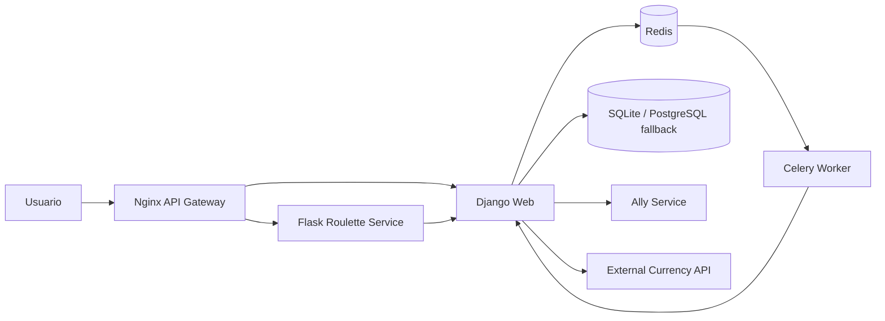

# Container Diagram

## Notes
- Nginx is the only public entry point.
- Django keeps the UI and orchestration.
- Flask executes the main roulette flow.
- Redis and Celery handle asynchronous audit tasks.
- Database stays SQLite for final demo stability; PostgreSQL is documented as a future improvement.
