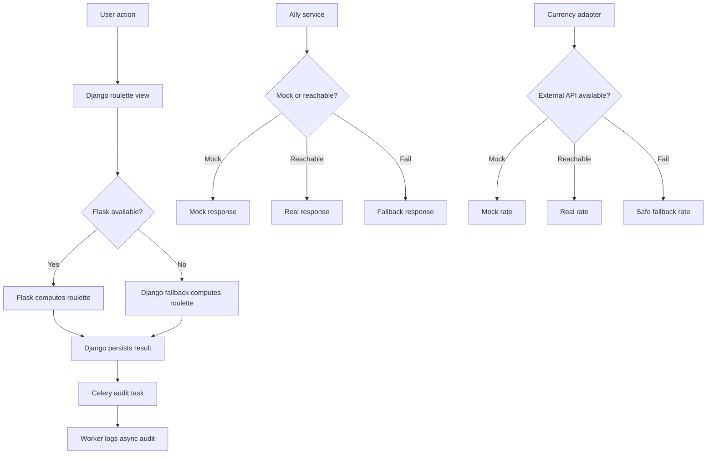

# Resilience Flow

```mermaid
flowchart TD
    A[User action] --> B[Django roulette view]
    B --> C{Flask available?}
    C -- Yes --> D[Flask computes roulette]
    C -- No --> E[Django fallback computes roulette]
    D --> F[Django persists result]
    E --> F
    F --> G[Celery audit task]
    G --> H[Worker logs async audit]

    I[Ally service] --> J{Mock or reachable?}
    J -- Mock --> K[Mock response]
    J -- Reachable --> L[Real response]
    J -- Fail --> M[Fallback response]

    N[Currency adapter] --> O{External API available?}
    O -- Mock --> P[Mock rate]
    O -- Reachable --> Q[Real rate]
    O -- Fail --> R[Safe fallback rate]
```

## Notes
- Fallbacks are visible in the UI and API responses.
- The user flow must never break because of missing Flask, ally service, external API or Celery.
