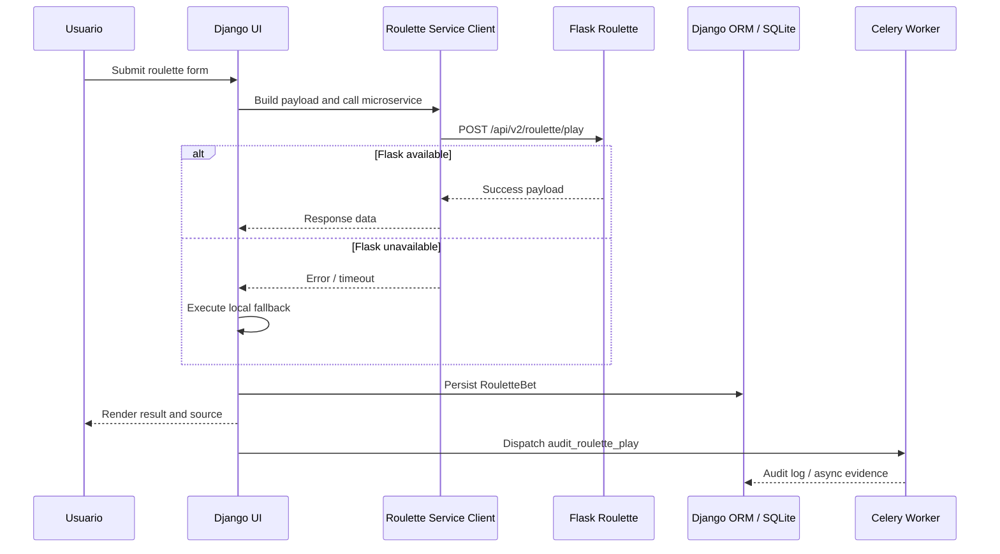

# Strangler Sequence

```mermaid
sequenceDiagram
    participant U as Usuario
    participant D as Django UI
    participant S as Roulette Service Client
    participant F as Flask Roulette
    participant DB as Django ORM / SQLite
    participant C as Celery Worker

    U->>D: Submit roulette form
    D->>S: Build payload and call microservice
    S->>F: POST /api/v2/roulette/play
    alt Flask available
        F-->>S: Success payload
        S-->>D: Response data
    else Flask unavailable
        S-->>D: Error / timeout
        D->>D: Execute local fallback
    end
    D->>DB: Persist RouletteBet
    D-->>U: Render result and source
    D->>C: Dispatch audit_roulette_play
    C-->>DB: Audit log / async evidence
```

## Notes
- Django keeps the UI and fallback path.
- Flask owns the main calculation in the happy path.
- Celery is best-effort and must never block the play response.
